# InnChoice

**InnChoice** is the automated room booking portal where Room Manager and Customer can signup , Room Manager can define the recurring timeslots , rooms available and number of days before advance booking, while a Customer can book from the available number of rooms and timeslots , can see or cancel his past or future bookings . 

## Installation

### Requirements

Python 3.6 
And additional requirements are in **requirements.txt** and will be installed through the below steps

### How to get started

* Download and install **python 3.6** and **git**
#### Download
* Go to `https://github.com/parthgpta/fsf20_scrntask` and click on `Fork`
* You will be redirected to *your* fork, `https://github.com/<yourname>/fsf20_scrntask`
* Clone using `$ git clone https://github.com/<yourname>/fsf20_scrntask`
#### Run
* Install virtualenv  
    - on Ubuntu: `$ sudo apt install python-virtualenv`  
    - on Windows Powershell `$ pip install virtualenv`  
* Create a virtual environment  
    - on Ubuntu: `$ virtualenv env -p python3.6`  
    - on Windows: `$ virtualenv env`  
* Activate the env:
    - on Ubuntu: `$ source env/bin/activate`  
    - on Windows: `$ ./env/scripts/activate`  
* Install the requirements: `$ pip install -r requirements.txt`

* Change directory to innchoice `$ cd innchoice`
* Make migrations `$ python manage.py makemigrations`  
* Migrate the changes to the database `$ python manage.py migrate`  
* Run the server `$ python manage.py runserver`
#### git setup
* `$ git remote add upstream https://github.com/parthgpta/fsf20_scrntask`
* `$ git checkout -b <module-name>`

#### Syncing with Fork:
* `$ git fetch upstream`
* `$ git merge upstream/master`
* `$ git push origin <module-name>`
* Open the link given after the previous command or go to `https://github.com/parthgpta/fsf20_scrntask` and create pull request

## Tests
Different components can be easily tested against unittesting 

For testing all components together \
`$python manage.py test`

Testing bookings app \
`$ python manage.py test bookings`\
`$ python manage.py test bookings.tests.test_urls`\
`$ python manage.py test bookings.tests.test_views`

Testing accounts app \
`$ python manage.py test accounts`\
`$ python manage.py test accounts.tests.test_urls`\
`$ python manage.py test accounts.tests.test_views`

## About
* **_Signing Up_** - User can signup and set User Type according to them either if they are Cutomer or Room Manager

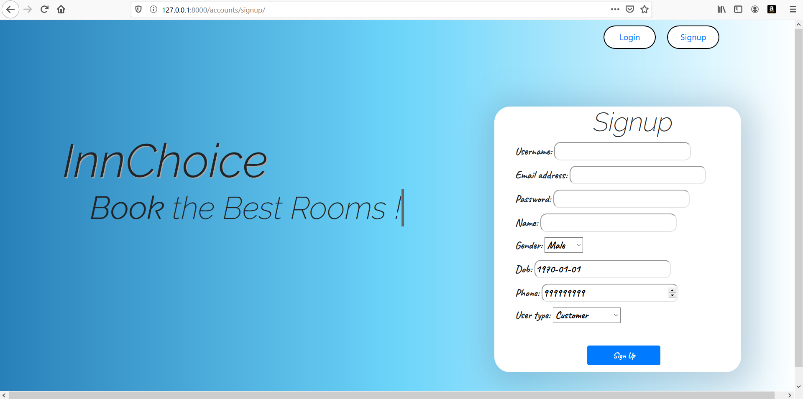

* **_Room Booking_** - Customer can Book Room from various available days and timeslots . 

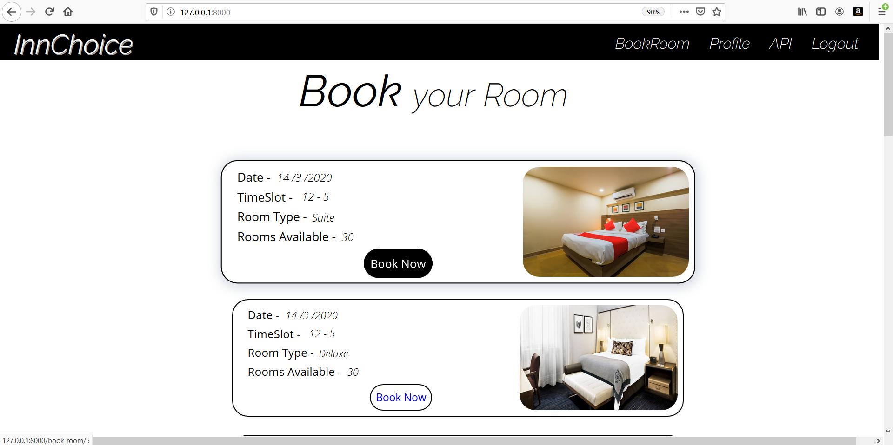

* **_Customer Profile_** - Customer can see his own past and future bookings and cancel any booking at any time . 

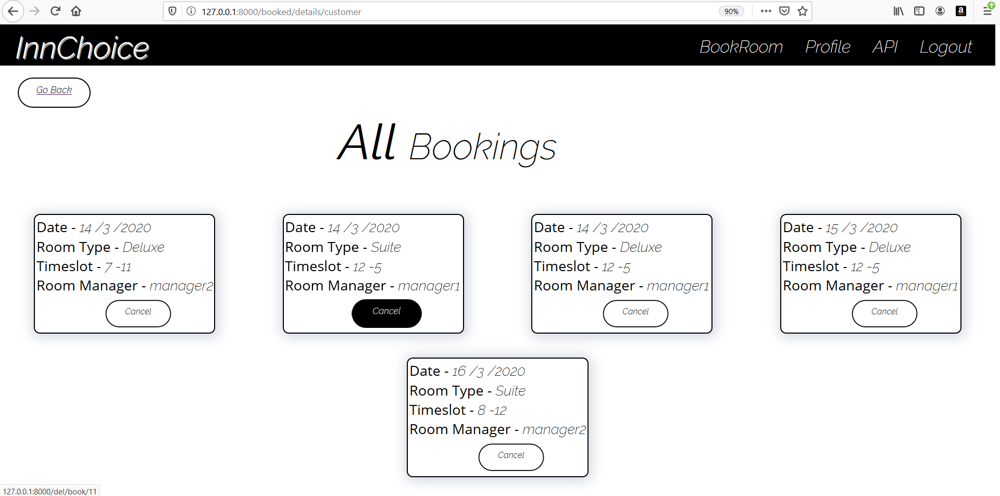

* **_Manager Profile_** - Room Manager can see all bookings , Add a specific room availability and Sets the various settings such as Default number of rooms available , timeslots and number of days before for advance booking for reocccurig slots .  

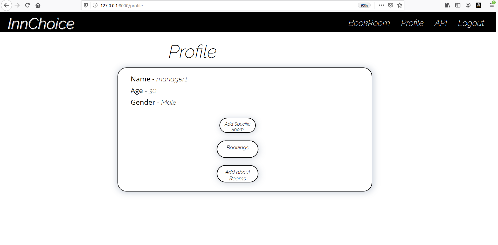

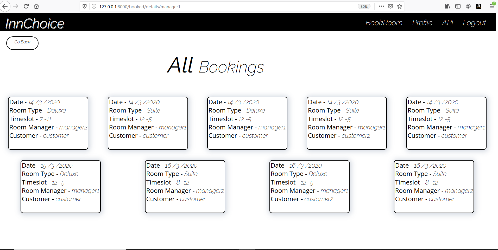

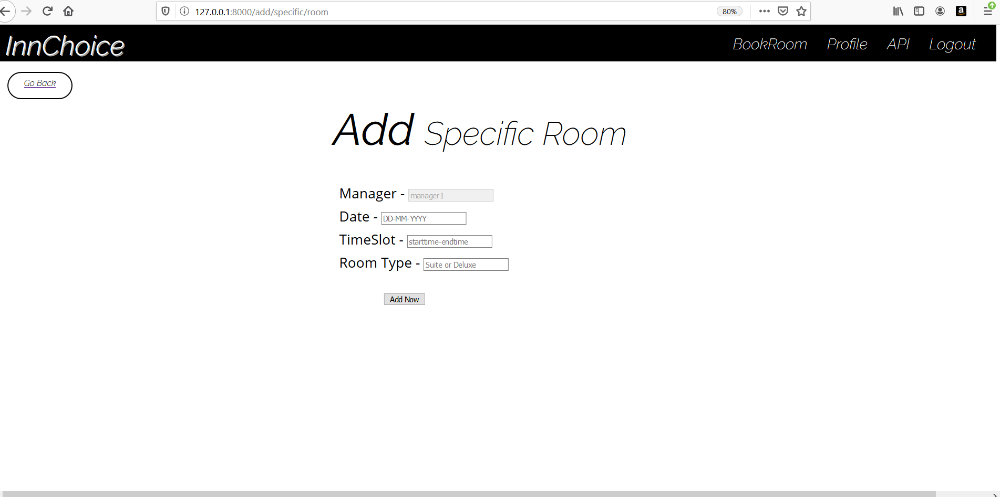

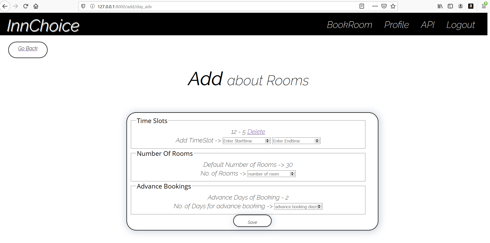

## API
Innchoice API endpoints help to get some of the data from our Database in machine-readable JSON format. Users can get data of all Registered Users , all available Room Slots , Timeslots , and details of all Bookings .

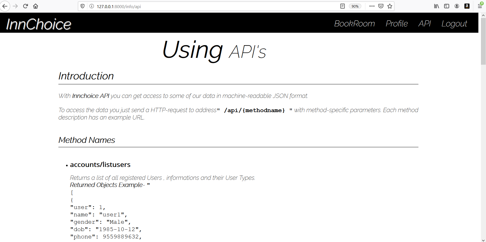

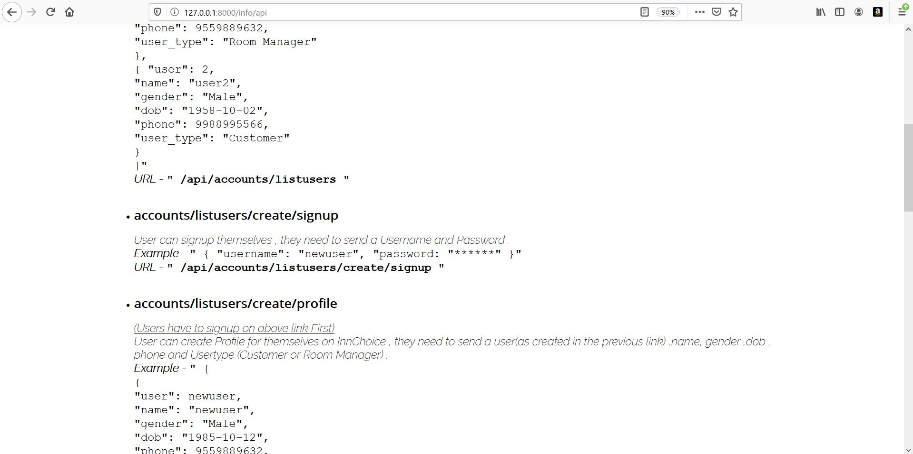

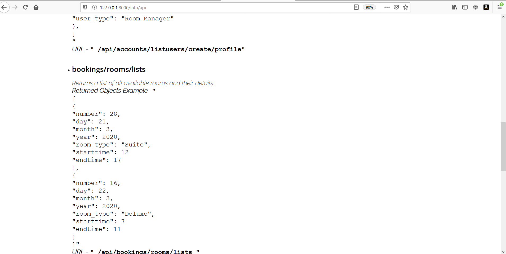

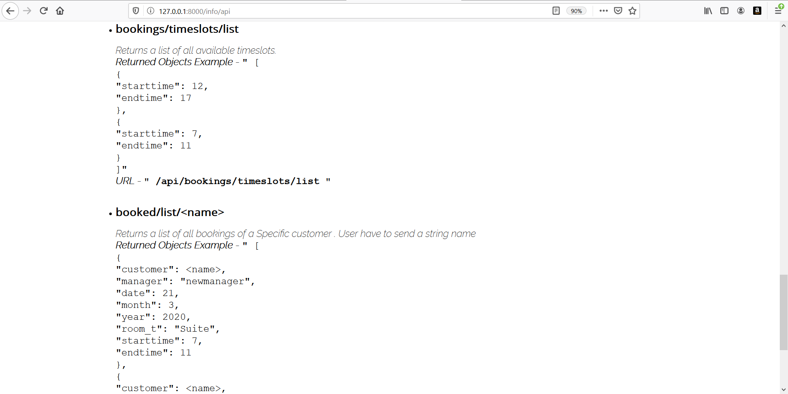

